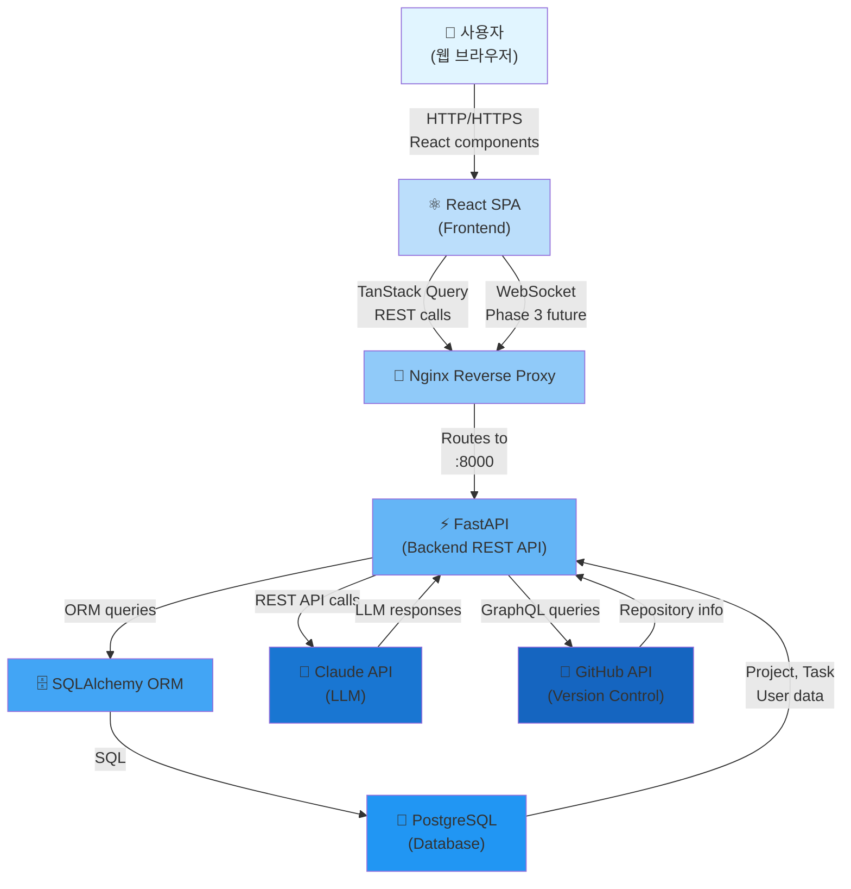

# Personal Jira — 시스템 아키텍처

## 시스템 개요

**Personal Jira**는 AI 에이전트가 자율적으로 소프트웨어를 설계, 개발, 배포할 수 있도록 지원하는 프로젝트 관리 플랫폼입니다.

### 사용자 구성
- **사람**: 1명 (프로젝트 관리자 / 기술 리더)
- **AI 에이전트**: 5개
  - **Director**: 프로젝트 계획 및 아키텍처 설계
  - **Git Agent**: 저장소 및 브랜치 관리
  - **Backend Agent**: API 및 데이터베이스 구현
  - **Frontend Agent**: UI/UX 구현 및 상태 관리
  - **Docs Agent**: 문서 자동 생성

### 목적
- AI 에이전트가 협력하여 복잡한 소프트웨어 프로젝트를 자동화
- 사람의 개입을 최소화하면서도 품질 보증
- 에이전트 간 협력 패턴 정립

---

## 기술 스택

### Frontend
- **Language**: TypeScript
- **Framework**: React 19
- **Build Tool**: Vite
- **UI Library**: shadcn/ui (Radix UI + Tailwind CSS)
- **State Management**: Zustand
- **API Client**: TanStack Query (React Query)
- **Runtime**: Node.js 18+

### Backend
- **Language**: Python 3.11+
- **Framework**: FastAPI
- **ORM**: SQLAlchemy + Alembic (migrations)
- **API Protocol**: RESTful + GraphQL (GitHub API integration)
- **Task Queue**: (Optional) Celery + Redis

### Database
- **Primary**: PostgreSQL 15
- **Schema**: SQLAlchemy ORM models
- **Migrations**: Alembic
- **Connection Pool**: psycopg2 + connection pooling

### Infrastructure
- **Containerization**: Docker + docker-compose
- **CI/CD**: GitHub Actions (자동 배포)
- **LLM Integration**: Claude API (Anthropic)
- **Version Control**: Git

---

## 디렉토리 구조

```
backend/workspace/
├── frontend/                     # React TypeScript 프론트엔드
│   ├── src/
│   │   ├── main.tsx             # 진입점
│   │   ├── App.tsx              # 루트 컴포넌트
│   │   ├── pages/               # 페이지 레이아웃
│   │   │   ├── Dashboard.tsx    # 대시보드 (프로젝트 관리)
│   │   │   ├── ProjectDetail.tsx # 프로젝트 상세 페이지
│   │   │   ├── TaskBoard.tsx    # Kanban 보드
│   │   │   └── Settings.tsx     # 설정 페이지
│   │   ├── components/          # 재사용 UI 컴포넌트
│   │   │   ├── Header.tsx       # 헤더 네비게이션
│   │   │   ├── Sidebar.tsx      # 사이드바
│   │   │   ├── TaskCard.tsx     # 태스크 카드
│   │   │   └── ProjectForm.tsx  # 프로젝트 생성/수정 폼
│   │   ├── hooks/               # React Hooks (custom)
│   │   │   ├── useProject.ts    # 프로젝트 상태
│   │   │   └── useTasks.ts      # 태스크 상태
│   │   ├── stores/              # Zustand 상태 스토어
│   │   │   ├── projectStore.ts  # 글로벌 프로젝트 상태
│   │   │   └── uiStore.ts       # UI 상태 (모달, 필터 등)
│   │   ├── api/                 # API 클라이언트 (TanStack Query)
│   │   │   ├── projects.ts      # /api/projects/* 엔드포인트
│   │   │   └── tasks.ts         # /api/tasks/* 엔드포인트
│   │   ├── types/               # TypeScript 타입 정의
│   │   │   ├── index.ts         # 공용 타입
│   │   │   ├── api.ts           # API 응답 타입
│   │   │   └── models.ts        # 도메인 모델 타입
│   │   └── utils/               # 유틸리티 함수
│   │       ├── formatDate.ts    # 날짜 포매팅
│   │       └── validation.ts    # 입력 검증
│   ├── public/                  # 정적 자산
│   ├── package.json             # npm 의존성
│   ├── vite.config.ts           # Vite 빌드 설정
│   ├── tsconfig.json            # TypeScript 설정
│   ├── .env.example             # 환경변수 예시
│   ├── Dockerfile               # 프론트엔드 컨테이너
│   └── .gitignore
│
├── backend/                      # FastAPI 백엔드 애플리케이션
│   ├── app/
│   │   ├── main.py              # FastAPI 인스턴스, 라우터 등록
│   │   ├── config.py            # 환경 설정 (DB URL, API keys 등)
│   │   ├── database.py          # DB 연결, 세션 관리
│   │   ├── models/              # SQLAlchemy ORM 모델
│   │   │   ├── __init__.py
│   │   │   ├── project.py       # Project 모델
│   │   │   ├── task.py          # Task 모델
│   │   │   └── user.py          # User 모델
│   │   ├── schemas/             # Pydantic 요청/응답 스키마
│   │   │   ├── __init__.py
│   │   │   ├── project.py       # ProjectCreate, ProjectResponse
│   │   │   └── task.py          # TaskCreate, TaskResponse
│   │   ├── routers/             # API 라우터 (엔드포인트)
│   │   │   ├── __init__.py
│   │   │   ├── projects.py      # /api/projects/* 엔드포인트
│   │   │   ├── tasks.py         # /api/tasks/* 엔드포인트
│   │   │   └── health.py        # /health 헬스체크
│   │   ├── services/            # 비즈니스 로직, 도메인 서비스
│   │   │   ├── __init__.py
│   │   │   ├── project_service.py  # 프로젝트 관리 로직
│   │   │   └── task_service.py     # 태스크 관리 로직
│   │   ├── dependencies.py       # FastAPI 의존성 주입
│   │   └── exceptions.py         # 커스텀 예외
│   ├── migrations/               # Alembic DB 마이그레이션
│   │   ├── env.py
│   │   ├── script.py.mako
│   │   └── versions/             # 마이그레이션 파일
│   ├── tests/                    # Pytest 테스트
│   │   ├── conftest.py           # Pytest 설정
│   │   ├── test_projects.py      # 프로젝트 API 테스트
│   │   └── test_tasks.py         # 태스크 API 테스트
│   ├── requirements.txt          # Python 의존성
│   ├── alembic.ini              # Alembic 설정
│   ├── Dockerfile               # 백엔드 컨테이너
│   ├── .env.example             # 환경변수 예시
│   └── .gitignore
│
├── docs/                         # 프로젝트 문서
│   ├── ARCHITECTURE.md          # 이 파일
│   ├── API.md                   # API 명세
│   ├── SETUP.md                 # 개발 환경 설정
│   └── agents/                  # 에이전트 관련 문서
│       ├── agent-docs.md        # 에이전트 전용 규칙
│       └── SHARED_LESSONS.md    # 과거 교훈 및 금지사항
│
├── docker-compose.yml           # 로컬 개발 환경 오케스트레이션
├── .gitignore                   # Git 무시 파일
├── .editorconfig                # 에디터 공통 설정
├── CLAUDE.md                    # 프로젝트 코딩 규칙 및 컨벤션
├── README.md                    # 프로젝트 개요
└── .env.example                 # 루트 환경변수 예시
```

---

## 데이터 흐름

### 아키텍처 다이어그램



### 주요 데이터 흐름

1. **프로젝트 조회**
   - 사용자가 웹 UI에서 프로젝트 목록 요청
   - React → TanStack Query → `GET /api/projects`
   - FastAPI → SQLAlchemy → PostgreSQL 쿼리
   - 응답: JSON 프로젝트 목록 및 메타데이터

2. **태스크 생성** (에이전트 기능)
   - Director 에이전트가 프로젝트 계획 후 `POST /api/projects/{id}/tasks`
   - FastAPI validates → SQLAlchemy creates row → PostgreSQL COMMIT
   - Claude API를 호출하여 태스크 상세 정보 생성
   - 백그라운드 작업으로 에이전트에게 알림

3. **리포지토리 동기화** (향후)
   - Backend Agent가 GitHub API를 통해 브랜치/PR 정보 수집
   - PersonalJira 태스크와 GitHub 이슈 매핑
   - 양방향 동기화 (자동 라벨 추가, 상태 업데이트)

4. **WebSocket 푸시** (Phase 3)
   - 태스크 상태 변경 시 → FastAPI → WebSocket push
   - React → 실시간 UI 업데이트 (새로고침 없음)

---

## Phase 로드맵

### Phase 1: 기초 구축 (MVP)
- **기능**: 프로젝트/태스크 CRUD, 기본 UI, PostgreSQL 연동
- **에이전트**: Director (계획만), Backend (API 스켈레톤)
- **완료 기준**:
  - API 모든 엔드포인트 동작
  - React 대시보드 렌더링 가능
  - 데이터베이스 마이그레이션 자동화

### Phase 2: 에이전트 통합
- **기능**: 전체 에이전트 활성화 (Git, Backend, Frontend, Docs), 자동 코드 생성
- **확대**: GitHub API 연동, Kanban 보드
- **완료 기준**:
  - 5개 에이전트가 협력하여 기능 자동 개발
  - 생성된 코드가 테스트를 통과
  - 자동화된 문서 생성

### Phase 3: 실시간 협력 (고급)
- **기능**: WebSocket 푸시, 실시간 알림, 에이전트 진행 상황 시각화
- **확대**: 복잡한 멀티-에이전트 워크플로우
- **완료 기준**:
  - 대시보드에서 실시간 에이전트 작업 모니터링
  - 동시성 제어 및 충돌 해결

---

## API 주요 엔드포인트

### Projects
- `GET /api/projects` - 프로젝트 목록 조회
- `POST /api/projects` - 새 프로젝트 생성
- `GET /api/projects/{id}` - 프로젝트 상세 조회
- `PUT /api/projects/{id}` - 프로젝트 수정
- `DELETE /api/projects/{id}` - 프로젝트 삭제

### Tasks
- `GET /api/projects/{project_id}/tasks` - 프로젝트 내 태스크 목록
- `POST /api/projects/{project_id}/tasks` - 새 태스크 생성
- `GET /api/tasks/{id}` - 태스크 상세 조회
- `PUT /api/tasks/{id}` - 태스크 수정
- `DELETE /api/tasks/{id}` - 태스크 삭제
- `PUT /api/tasks/{id}/status` - 태스크 상태 변경

### Health Check
- `GET /health` - 헬스체크

---

## 데이터베이스 스키마 (요약)

### projects 테이블
```sql
CREATE TABLE projects (
    id UUID PRIMARY KEY,
    name VARCHAR(255) NOT NULL,
    description TEXT,
    status VARCHAR(50),  -- 'planning', 'active', 'archived'
    tech_stack JSONB,    -- frontend, backend, database, infra
    created_at TIMESTAMP DEFAULT CURRENT_TIMESTAMP,
    updated_at TIMESTAMP DEFAULT CURRENT_TIMESTAMP
);
```

### tasks 테이블
```sql
CREATE TABLE tasks (
    id UUID PRIMARY KEY,
    project_id UUID REFERENCES projects(id),
    title VARCHAR(255) NOT NULL,
    description TEXT,
    status VARCHAR(50),  -- 'todo', 'in_progress', 'review', 'done'
    priority VARCHAR(50), -- 'low', 'medium', 'high'
    assignee_agent VARCHAR(100),  -- 'backend', 'frontend', 'git', 'docs'
    created_at TIMESTAMP DEFAULT CURRENT_TIMESTAMP,
    updated_at TIMESTAMP DEFAULT CURRENT_TIMESTAMP
);
```

---

## 배포 구조

### Docker Compose (로컬 개발)
```yaml
services:
  postgres:
    image: postgres:15
    ports: ["5432:5432"]

  backend:
    build: ./backend
    ports: ["8000:8000"]
    depends_on: [postgres]

  frontend:
    build: ./frontend
    ports: ["5173:5173"]
    depends_on: [backend]
```

### 프로덕션 배포 (향후)
- **Backend**: Kubernetes / Vercel / Fly.io
- **Frontend**: Vercel / Netlify / CloudFront
- **Database**: AWS RDS / Supabase / Railway
- **CI/CD**: GitHub Actions → Docker build → Registry → Deploy

---

## 보안 고려사항

- **인증**: (구현 필요) JWT / OAuth 2.0
- **권한 관리**: RBAC (Role-Based Access Control)
- **API 보안**: CORS 설정, Rate limiting, 입력 검증
- **데이터 암호화**: TLS/SSL for transport, sensitive data encryption at rest
- **API 키 관리**: 환경변수, 보안 보관소 (AWS Secrets Manager / 1Password)

---

## 성능 고려사항

- **데이터베이스**: 인덱싱 (project_id, status), connection pooling
- **캐싱**: Redis (optional), TanStack Query 클라이언트 캐싱
- **쿼리 최적화**: N+1 쿼리 방지, 조인 최소화
- **프론트엔드**: 코드 스플릿, 이미지 최적화, 번들 크기 최소화
- **모니터링**: 로깅 (구조화), 메트릭 수집, 에러 추적

---

## 추가 참고

자세한 API 명세는 `/docs/API.md`를 참조하세요.
개발 환경 설정은 `/docs/SETUP.md`를 참조하세요.
에이전트 전용 규칙은 `/docs/agents/agent-docs.md`를 참조하세요.
<!-- AUTO-UPDATED -->
## 자동 갱신 (2026-03-26 22:38 UTC)

### 등록된 라우터 (main.py)
- 없음

### 모델 exports (models/__init__.py)
- 없음
