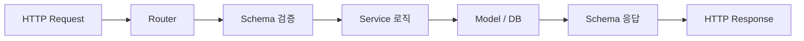
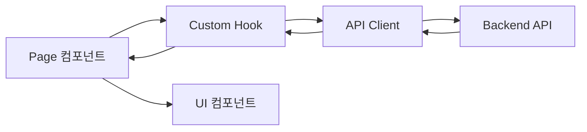

# CONVENTIONS.md — Personal Jira MVP

> 코딩 규칙, 네이밍 컨벤션, API 설계 원칙, 테스트 전략, Git 워크플로우 문서.

---

## 목차

- [Python (백엔드)](#python-백엔드)
- [TypeScript (프론트엔드)](#typescript-프론트엔드)
- [네이밍 규칙](#네이밍-규칙)
- [API 설계](#api-설계)
- [테스트](#테스트)
- [Git 워크플로우](#git-워크플로우)
- [파일 네이밍](#파일-네이밍)

---

## Python (백엔드)

### 스타일 & 도구

| 도구 | 설정 |
|------|------|
| 포맷터 | **black** (`line-length = 88`) |
| import 정렬 | **isort** (`profile = "black"`) |
| 린터 | **ruff** (PEP 8 + pyflakes + isort 호환) |
| 타입 체크 | **mypy** (`strict = true`) |

### 코드 스타일

- PEP 8 준수, black 자동 포맷
- import 순서: 표준 라이브러리 → 서드파티 → 프로젝트 내부 (isort가 자동 정렬)
- 절대 import 사용 (`from app.models.task import Task`)
- 타입 힌트 필수 — 함수 인자, 반환값, 변수 모두 명시

### 예시: 서비스 함수

```python
from uuid import UUID

from sqlalchemy.orm import Session

from app.models.task import Task
from app.schemas.task import TaskCreate, TaskResponse


def create_task(db: Session, payload: TaskCreate) -> TaskResponse:
    """태스크를 생성하고 응답 스키마로 반환한다."""
    task = Task(
        title=payload.title,
        description=payload.description,
        story_id=payload.story_id,
        status="todo",
        priority=payload.priority,
    )
    db.add(task)
    db.commit()
    db.refresh(task)
    return TaskResponse.model_validate(task)
```

### 예시: Pydantic 스키마

```python
from datetime import datetime
from uuid import UUID

from pydantic import BaseModel, ConfigDict


class TaskBase(BaseModel):
    title: str
    description: str | None = None
    priority: int = 0


class TaskCreate(TaskBase):
    story_id: UUID


class TaskResponse(TaskBase):
    model_config = ConfigDict(from_attributes=True)

    id: UUID
    story_id: UUID
    status: str
    created_at: datetime
    updated_at: datetime
```

---

## TypeScript (프론트엔드)

### 스타일 & 도구

| 도구 | 설정 |
|------|------|
| 린터 | **ESLint** (recommended + React hooks 규칙) |
| 포맷터 | **Prettier** (`singleQuote: true`, `trailingComma: "all"`) |
| 빌드 | **Vite** |
| UI | **React** + **Tailwind CSS** |

### 코드 스타일

- `singleQuote` 사용 (`'hello'`, not `"hello"`)
- trailing comma 항상 사용
- `@/` alias로 절대 경로 import (`@/components/Button`)
- `type` 키워드로 타입 import (`import type { Task } from '@/types/task'`)
- 컴포넌트는 named export (`export function Button()`, not `export default`)

### 예시: React 컴포넌트

```tsx
import { useState } from 'react';

import { Button } from '@/components/Button';
import { useLabels } from '@/hooks/useLabels';
import type { Label } from '@/types/label';

interface LabelBadgeProps {
  label: Label;
  onRemove?: (id: string) => void;
}

export function LabelBadge({ label, onRemove }: LabelBadgeProps) {
  const [isHovered, setIsHovered] = useState(false);

  return (
    <span
      className="inline-flex items-center gap-1 rounded-full px-2 py-1 text-sm"
      style={{ backgroundColor: label.color }}
      onMouseEnter={() => setIsHovered(true)}
      onMouseLeave={() => setIsHovered(false)}
    >
      {label.name}
      {isHovered && onRemove && (
        <Button variant="ghost" size="sm" onClick={() => onRemove(label.id)}>
          x
        </Button>
      )}
    </span>
  );
}
```

---

## 네이밍 규칙

| 대상 | 규칙 | 예시 |
|------|------|------|
| API 엔드포인트 | `snake_case`, 복수형 | `/api/tasks`, `/api/task_labels` |
| DB 테이블 | `snake_case`, 복수형 | `tasks`, `task_labels` |
| DB 컬럼 | `snake_case` | `story_id`, `created_at` |
| Python 변수/함수 | `snake_case` | `create_task`, `epic_id` |
| Python 클래스 | `PascalCase` | `TaskCreate`, `EpicService` |
| TypeScript 변수/함수 | `camelCase` | `createTask`, `epicId` |
| TypeScript 타입/인터페이스 | `PascalCase` | `TaskResponse`, `EpicListProps` |
| React 컴포넌트 | `PascalCase` | `KanbanPage`, `StatusBadge` |
| 커스텀 훅 | `useCamelCase` | `useTasks`, `useEpics` |
| CSS 클래스 | `kebab-case` (Tailwind 유틸리티) | `text-sm`, `bg-blue-500` |
| 환경변수 | `UPPER_SNAKE_CASE` | `DATABASE_URL`, `POSTGRES_PASSWORD` |

---

## API 설계

### 원칙

- **RESTful** — 리소스 중심, HTTP 메서드로 동작 구분
- **복수형** 리소스명 — `/api/tasks` (not `/api/task`)
- **prefix** — 모든 엔드포인트는 `/api/` prefix

### CRUD 엔드포인트 패턴

```
GET    /api/{resources}          — 목록 조회 (페이지네이션)
POST   /api/{resources}          — 생성
GET    /api/{resources}/{id}     — 단건 조회
PUT    /api/{resources}/{id}     — 전체 수정
PATCH  /api/{resources}/{id}     — 부분 수정
DELETE /api/{resources}/{id}     — 삭제
```

### 페이지네이션

- `offset` / `limit` 방식 사용
- 기본값: `offset=0`, `limit=20`
- 응답에 전체 개수 포함

```
GET /api/tasks?offset=0&limit=20
```

```json
{
  "items": [...],
  "total": 42,
  "offset": 0,
  "limit": 20
}
```

### 에러 응답

모든 에러는 `detail` 필드를 포함하는 JSON 응답:

```json
{ "detail": "Task not found" }
```

| 상태 코드 | 의미 | 예시 |
|-----------|------|------|
| `400` | 잘못된 요청 | 유효하지 않은 status 값 |
| `404` | 리소스 없음 | 존재하지 않는 task ID |
| `422` | 유효성 검증 실패 | 필수 필드 누락 (FastAPI 자동) |
| `500` | 서버 에러 | `err.message` 미포함 — 보안 |

### 필터링 & 검색

쿼리 파라미터로 필터링:

```
GET /api/tasks?status=todo&story_id={uuid}
GET /api/stories?epic_id={uuid}
```

---

## 테스트

### 백엔드: pytest

| 도구 | 용도 |
|------|------|
| **pytest** | 테스트 러너 |
| **pytest-asyncio** | 비동기 테스트 |
| **httpx** `AsyncClient` | API 통합 테스트 |
| **fixtures** | DB 세션, 테스트 데이터 설정 |

#### 테스트 파일 위치

```
backend/tests/
├── conftest.py       # 공통 fixture (db, client, 테스트 데이터)
├── test_epics.py
├── test_stories.py
├── test_tasks.py
└── test_labels.py
```

#### 테스트 작성 규칙

- 파일명: `test_{module}.py`
- 함수명: `test_{동작}_{조건}` — 예: `test_create_task_returns_201`
- fixture로 DB 세션과 테스트 데이터 주입
- 각 테스트는 독립적 — 다른 테스트 결과에 의존하지 않음

#### 예시: API 통합 테스트

```python
import pytest
from httpx import AsyncClient

from app.main import app


@pytest.fixture
async def client() -> AsyncClient:
    async with AsyncClient(app=app, base_url="http://test") as ac:
        yield ac


@pytest.mark.asyncio
async def test_create_task_returns_201(client: AsyncClient) -> None:
    payload = {
        "title": "구현: 로그인 API",
        "description": "JWT 기반 인증",
        "story_id": "...",
        "priority": 1,
    }
    response = await client.post("/api/tasks", json=payload)

    assert response.status_code == 201
    data = response.json()
    assert data["title"] == payload["title"]
    assert data["status"] == "todo"
```

### 프론트엔드: Vitest + React Testing Library

| 도구 | 용도 |
|------|------|
| **Vitest** | 테스트 러너 (Vite 네이티브) |
| **React Testing Library** | 컴포넌트 렌더링 + 사용자 상호작용 테스트 |
| **MSW** | API 모킹 (서비스 워커) |

#### 테스트 작성 규칙

- 파일명: `{Component}.test.tsx` (컴포넌트와 동일 디렉토리)
- 사용자 관점에서 테스트 — DOM 쿼리는 `getByRole`, `getByText` 우선
- 구현 세부사항이 아닌 동작을 테스트

---

## Git 워크플로우

### 커밋 메시지: Conventional Commits

```
<type>: <description>

[optional body]
```

| type | 용도 |
|------|------|
| `feat` | 새 기능 |
| `fix` | 버그 수정 |
| `docs` | 문서 변경 |
| `test` | 테스트 추가/수정 |
| `refactor` | 기능 변경 없는 코드 개선 |
| `chore` | 빌드, 의존성, 설정 변경 |

예시:
```
feat: 태스크 라벨 CRUD API 추가
fix: 에픽 삭제 시 하위 스토리 cascade 누락 수정
docs: ARCHITECTURE.md DB 스키마 섹션 추가
test: 태스크 상태 전환 엣지 케이스 테스트 추가
```

### 브랜치 네이밍

```
<type>/<short-description>
```

예시:
```
feat/task-labels-api
fix/epic-cascade-delete
docs/conventions-md
```

- `main` 브랜치에 직접 push 금지 — PR을 통해서만 머지
- 브랜치명은 영문 소문자, 하이픈(`-`) 구분

---

## 파일 네이밍

### 백엔드 (Python)

| 대상 | 규칙 | 예시 |
|------|------|------|
| 모듈 파일 | `snake_case.py` | `task_service.py`, `epic.py` |
| 테스트 파일 | `test_snake_case.py` | `test_tasks.py`, `test_labels.py` |
| 패키지 | `snake_case/` + `__init__.py` | `models/`, `routers/` |

### 프론트엔드 (TypeScript/React)

| 대상 | 규칙 | 예시 |
|------|------|------|
| React 컴포넌트 | `PascalCase.tsx` | `KanbanPage.tsx`, `StatusBadge.tsx` |
| 커스텀 훅 | `useCamelCase.ts` | `useTasks.ts`, `useEpics.ts` |
| API 클라이언트 | `camelCase.ts` | `tasks.ts`, `client.ts` |
| 타입 정의 | `camelCase.ts` | `task.ts`, `epic.ts` |
| 설정 파일 | `camelCase` | `vite.config.ts`, `tailwind.config.js` |
| 테스트 파일 | `{Component}.test.tsx` | `KanbanPage.test.tsx` |

---

## 데이터 흐름 다이어그램

### 백엔드 요청 처리



### 프론트엔드 데이터 흐름


