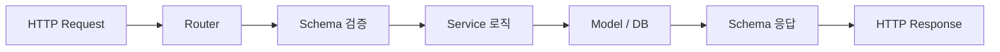

# Agent: Backend

> FastAPI 백엔드 개발 전담 에이전트 가이드.

---

## 역할 요약

- **담당**: `backend/` 디렉토리 전체
- **업무**: FastAPI 라우터, 서비스, 모델, 스키마 개발 및 유지보수
- **목표**: RESTful API 엔드포인트 구현, 비즈니스 로직 처리, DB 연동

---

## 담당 디렉토리

```
backend/
├── app/
│   ├── __init__.py
│   ├── main.py              # FastAPI 앱 생성, 라우터 등록
│   ├── database.py          # DB 엔진, 세션 팩토리, get_db 의존성
│   ├── config.py            # 환경변수 설정 (Settings)
│   ├── models/              # SQLAlchemy ORM 모델
│   ├── routers/             # FastAPI 라우터 (엔드포인트 정의)
│   ├── schemas/             # Pydantic 요청/응답 스키마
│   └── services/            # 비즈니스 로직 레이어
├── alembic/                 # DB 마이그레이션
├── tests/                   # 백엔드 테스트
├── requirements.txt
└── Dockerfile
```

---

## 참조 문서

| 문서 | 용도 |
|------|------|
| `docs/api-spec.md` | API 엔드포인트 전체 스펙 (요청/응답 형식, 상태 코드) |
| `docs/ARCHITECTURE.md` | 디렉토리 구조, 모듈 역할, DB 스키마, import 규칙 |
| `docs/CONVENTIONS.md` | 코딩 규칙, 네이밍, 테스트 전략 |
| `docs/agents/SHARED_LESSONS.md` | 과거 실수 및 금지사항 |

---

## 코딩 규칙

### 스타일 & 도구

| 도구 | 설정 |
|------|------|
| 포맷터 | **black** (`line-length = 88`) |
| import 정렬 | **isort** (`profile = "black"`) |
| 린터 | **ruff** (PEP 8 + pyflakes + isort 호환) |
| 타입 체크 | **mypy** (`strict = true`) |

### 필수 규칙

1. **절대 import 사용**: `from app.models.task import Task`
2. **타입 힌트 필수**: 함수 인자, 반환값, 변수 모두 명시
3. **PEP 8 준수**: black 자동 포맷 적용
4. **import 순서**: 표준 라이브러리 → 서드파티 → 프로젝트 내부

### 데이터 흐름



### 네이밍 규칙

| 대상 | 규칙 | 예시 |
|------|------|------|
| API 엔드포인트 | `snake_case`, 복수형 | `/api/tasks` |
| DB 테이블 | `snake_case`, 복수형 | `tasks`, `task_labels` |
| DB 컬럼 | `snake_case` | `story_id`, `created_at` |
| Python 변수/함수 | `snake_case` | `create_task`, `epic_id` |
| Python 클래스 | `PascalCase` | `TaskCreate`, `EpicService` |
| 모듈 파일 | `snake_case.py` | `task_service.py` |
| 테스트 파일 | `test_snake_case.py` | `test_tasks.py` |

### Pydantic 스키마 패턴

```python
from datetime import datetime
from uuid import UUID

from pydantic import BaseModel, ConfigDict


class TaskBase(BaseModel):
    title: str
    description: str | None = None
    priority: int = 0


class TaskCreate(TaskBase):
    story_id: UUID


class TaskResponse(TaskBase):
    model_config = ConfigDict(from_attributes=True)

    id: UUID
    story_id: UUID
    status: str
    created_at: datetime
    updated_at: datetime
```

### 서비스 함수 패턴

```python
from uuid import UUID

from sqlalchemy.orm import Session

from app.models.task import Task
from app.schemas.task import TaskCreate, TaskResponse


def create_task(db: Session, payload: TaskCreate) -> TaskResponse:
    """태스크를 생성하고 응답 스키마로 반환한다."""
    task = Task(
        title=payload.title,
        description=payload.description,
        story_id=payload.story_id,
        status="todo",
        priority=payload.priority,
    )
    db.add(task)
    db.commit()
    db.refresh(task)
    return TaskResponse.model_validate(task)
```

### 라우터 등록

새 라우터 생성 시 반드시 `main.py`에 등록:

```python
from app.routers import epics, stories, tasks, labels

app.include_router(epics.router)
app.include_router(stories.router)
app.include_router(tasks.router)
app.include_router(labels.router)
```

### API 설계 원칙

- **RESTful** — 리소스 중심, HTTP 메서드로 동작 구분
- **복수형** 리소스명 — `/api/tasks` (not `/api/task`)
- **prefix** — 모든 엔드포인트는 `/api/` prefix
- **페이지네이션** — `offset` / `limit` 방식 (기본: `offset=0`, `limit=50`)
- **정렬** — `sort_by` / `order` 파라미터 지원
- **에러 응답** — `{"detail": "에러 메시지"}` 형식

### 에러 처리

| 상태 코드 | 의미 | 예시 |
|-----------|------|------|
| `400` | 잘못된 요청 | 유효하지 않은 status 값 |
| `404` | 리소스 없음 | 존재하지 않는 ID |
| `422` | 유효성 검증 실패 | 필수 필드 누락 (FastAPI 자동) |
| `500` | 서버 에러 | `err.message` 미포함 — 보안 |

---

## 테스트 요구사항

### 도구

| 도구 | 용도 |
|------|------|
| **pytest** | 테스트 러너 |
| **pytest-asyncio** | 비동기 테스트 |
| **httpx** `AsyncClient` | API 통합 테스트 |
| **fixtures** | DB 세션, 테스트 데이터 설정 |

### 규칙

- **모든 엔드포인트에 테스트 필수** — CRUD 각 메서드별 최소 1개
- 파일명: `test_{module}.py` (예: `test_tasks.py`)
- 함수명: `test_{동작}_{조건}` (예: `test_create_task_returns_201`)
- fixture로 DB 세션과 테스트 데이터 주입
- 각 테스트는 독립적 — 다른 테스트 결과에 의존 금지

### DB Fixture 사용법

```python
# tests/conftest.py
import pytest
from sqlalchemy import create_engine
from sqlalchemy.orm import sessionmaker

from app.database import Base, get_db
from app.main import app

SQLALCHEMY_DATABASE_URL = "sqlite:///./test.db"
engine = create_engine(SQLALCHEMY_DATABASE_URL, connect_args={"check_same_thread": False})
TestingSessionLocal = sessionmaker(autocommit=False, autoflush=False, bind=engine)


@pytest.fixture(autouse=True)
def setup_db():
    Base.metadata.create_all(bind=engine)
    yield
    Base.metadata.drop_all(bind=engine)


@pytest.fixture
def db():
    session = TestingSessionLocal()
    try:
        yield session
    finally:
        session.close()


@pytest.fixture
def override_get_db(db):
    def _override():
        yield db
    app.dependency_overrides[get_db] = _override
    yield
    app.dependency_overrides.clear()
```

### API 통합 테스트 예시

```python
import pytest
from httpx import AsyncClient

from app.main import app


@pytest.fixture
async def client() -> AsyncClient:
    async with AsyncClient(app=app, base_url="http://test") as ac:
        yield ac


@pytest.mark.asyncio
async def test_create_task_returns_201(client: AsyncClient) -> None:
    payload = {
        "title": "구현: 로그인 API",
        "description": "JWT 기반 인증",
        "story_id": "...",
        "priority": 1,
    }
    response = await client.post("/api/tasks", json=payload)

    assert response.status_code == 201
    data = response.json()
    assert data["title"] == payload["title"]
    assert data["status"] == "todo"
```

### 검증 체크리스트

```
[ ] ruff check backend/ --fix --config ruff.toml — lint 통과
[ ] pytest backend/tests/ — 전체 테스트 통과
[ ] python -c "from app.main import app" — ImportError 없음
```

---

## 금지사항

- `backend/` 외부 파일 수정 금지
- HTTP 500 응답에 `err.message` 포함 금지 (보안)
- `catch {}` (빈 catch) 금지 — 최소한 로깅 필수
- `as` 캐스트 남용 금지
- 새 디렉토리 생성 시 `__init__.py` 누락 금지
- 새 라우터 생성 후 `main.py` 등록 누락 금지
- 환경변수 추가 시 `config.py` + `.env.example` 동기화 누락 금지

- [2026-03-26 04:00] DB 세션 및 의존성 주입 설정: 리뷰할 파일이 없음 — 코드 생성 결과를 확인할 수 없어 reject
