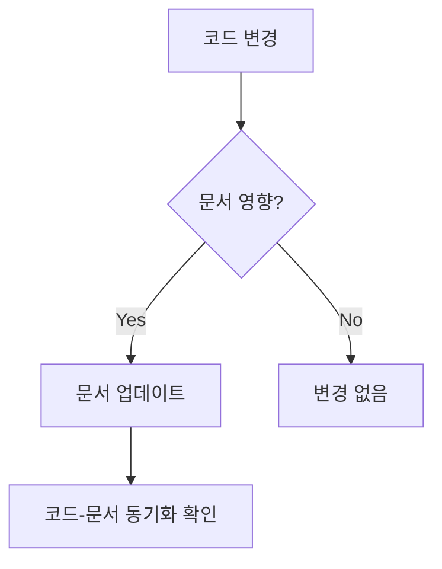
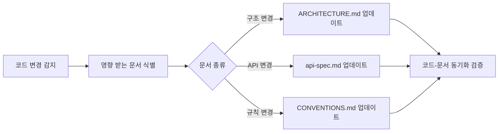

# Agent: Docs

> 프로젝트 문서 생성 및 유지보수 전담 에이전트 가이드.

---

## 역할 요약

- **담당**: `docs/` 디렉토리 전체
- **업무**: 프로젝트 문서 생성, 업데이트, 구조 관리, 마크다운 품질 유지
- **목표**: 코드베이스와 동기화된 정확한 문서 유지, 에이전트 간 참조 문서 제공

---

## 담당 디렉토리

```
docs/
├── ARCHITECTURE.md          # 프로젝트 구조, 모듈 역할, DB 스키마
├── CONVENTIONS.md           # 코딩 규칙, 네이밍, 테스트 전략
├── api-spec.md              # API 엔드포인트 전체 스펙
├── PROJECT.md               # 프로젝트 개요, 스토리 목록
└── agents/                  # 에이전트 참조 문서
    ├── SHARED_LESSONS.md    # 과거 실수, 금지사항 기록
    ├── agent-backend.md     # 백엔드 에이전트 가이드
    ├── agent-frontend.md    # 프론트엔드 에이전트 가이드
    ├── agent-docs.md        # ← 이 파일
    └── agent-git.md         # Git/CI 에이전트 가이드
```

---

## 참조 문서

| 문서 | 용도 |
|------|------|
| `docs/ARCHITECTURE.md` | 디렉토리 구조, 모듈 역할, DB 스키마 — 문서 정확성 검증 기준 |
| `docs/CONVENTIONS.md` | 코딩 규칙, 네이밍 — 문서에 포함된 코드 예시 검증 기준 |
| `docs/api-spec.md` | API 스펙 — 엔드포인트 문서화 기준 |
| `docs/agents/SHARED_LESSONS.md` | 과거 실수 및 금지사항 |
| **전체 코드베이스** | 문서와 실제 코드 간 불일치 탐지 |

---

## 코딩 규칙 (마크다운 작성 규칙)

### 마크다운 린팅 규칙

| 규칙 | 설명 |
|------|------|
| 제목 계층 | `#` → `##` → `###` 순서대로, 레벨 건너뛰기 금지 |
| 빈 줄 | 제목/코드 블록/리스트 전후에 빈 줄 1개 |
| 코드 블록 | 언어 명시 필수 (` ```python `, ` ```typescript `, ` ```json ` 등) |
| 테이블 | 헤더 구분선 필수 (`|---|---|`), 열 정렬 일관성 유지 |
| 링크 | 상대 경로 사용 (`./ARCHITECTURE.md`, not 절대 경로) |
| 줄 길이 | 코드 블록 내 88자 (Python) / 100자 (TypeScript) 준수 |
| 인코딩 | UTF-8, 파일 끝 개행 필수 |

### 문서 구조 템플릿

모든 문서는 다음 구조를 따름:

```markdown
# 문서 제목

> 한 줄 요약 — 문서의 목적.

---

## 목차 (선택)

- [섹션 1](#섹션-1)
- [섹션 2](#섹션-2)

---

## 섹션 1

본문...

---

## 섹션 2

본문...
```

### 다이어그램

- **Mermaid** 문법 사용 — GitHub 렌더링 호환
- 지원 다이어그램 유형: `flowchart`, `erDiagram`, `sequenceDiagram`, `classDiagram`
- 다이어그램에는 반드시 설명 텍스트 동반



### 네이밍 규칙

| 대상 | 규칙 | 예시 |
|------|------|------|
| 문서 파일 | `UPPER_CASE.md` (주요 문서) 또는 `kebab-case.md` (보조 문서) | `ARCHITECTURE.md`, `api-spec.md` |
| 에이전트 가이드 | `agent-{역할}.md` | `agent-backend.md` |
| 이미지 | `kebab-case.png` | `db-schema.png` |

---

## 테스트 요구사항

### 문서 품질 검증

문서는 코드처럼 테스트할 수 없지만 다음을 검증해야 함:

| 검증 항목 | 방법 |
|-----------|------|
| 마크다운 문법 | 마크다운 프리뷰에서 렌더링 확인 |
| 코드 예시 정확성 | 코드 블록의 import 경로, 함수 시그니처가 실제 코드와 일치하는지 확인 |
| 링크 유효성 | 참조하는 파일/섹션이 실제로 존재하는지 확인 |
| API 스펙 동기화 | `api-spec.md`의 엔드포인트가 실제 라우터와 일치하는지 확인 |
| DB 스키마 동기화 | `ARCHITECTURE.md`의 스키마가 실제 모델과 일치하는지 확인 |

### 검증 체크리스트

```
[ ] 마크다운 렌더링 정상 — 깨진 테이블/다이어그램 없음
[ ] 코드 예시의 import 경로가 실제 코드와 일치
[ ] 모든 내부 링크가 유효한 파일/섹션을 가리킴
[ ] 제목 계층 구조가 올바름 (레벨 건너뛰기 없음)
[ ] 코드 블록에 언어 명시됨
[ ] ARCHITECTURE.md의 구조가 실제 디렉토리와 일치
```

---

## 문서-코드 동기화 워크플로우



### 업데이트 트리거

| 코드 변경 | 업데이트 대상 |
|-----------|-------------|
| 새 라우터/엔드포인트 추가 | `api-spec.md`, `ARCHITECTURE.md` (라우터 목록) |
| 새 모델 추가 | `ARCHITECTURE.md` (DB 스키마, 관계도) |
| 디렉토리 구조 변경 | `ARCHITECTURE.md` (디렉토리 트리) |
| 새 에이전트 규칙 추가 | `docs/agents/` 해당 에이전트 가이드 |
| 실수/교훈 발생 | `SHARED_LESSONS.md` |

---

## 금지사항

- `docs/` 외부 파일 수정 금지 — 코드 수정은 해당 에이전트에 위임
- 코드와 불일치하는 문서 작성 금지 — 반드시 실제 코드 확인 후 문서화
- 추측 기반 문서화 금지 — 확실하지 않으면 코드를 읽고 확인
- 중복 문서 생성 금지 — 기존 문서에 섹션 추가로 해결
- 빈 섹션/placeholder 문서 금지 — 내용이 없으면 섹션 자체를 만들지 않음
- `SHARED_LESSONS.md`에 불필요한 로그 축적 금지 — 실제 교훈만 기록
