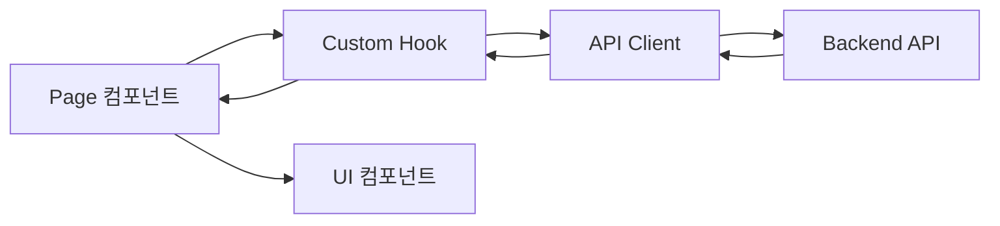

# Agent: Frontend

> React 프론트엔드 개발 전담 에이전트 가이드.

---

## 역할 요약

- **담당**: `frontend/` 디렉토리 전체
- **업무**: React 컴포넌트, 페이지, 커스텀 훅, API 클라이언트, 타입 정의 개발 및 유지보수
- **목표**: 사용자 인터페이스 구현, 백엔드 API 연동, 상태 관리

---

## 담당 디렉토리

```
frontend/
├── src/
│   ├── components/          # 재사용 가능한 UI 컴포넌트
│   │   ├── Button.tsx
│   │   ├── Modal.tsx
│   │   ├── StatusBadge.tsx
│   │   └── Layout.tsx
│   ├── pages/               # 라우트별 페이지 컴포넌트
│   │   ├── DashboardPage.tsx
│   │   ├── KanbanPage.tsx
│   │   ├── EpicListPage.tsx
│   │   └── StoryDetailPage.tsx
│   ├── hooks/               # 커스텀 React 훅
│   │   ├── useEpics.ts
│   │   ├── useStories.ts
│   │   ├── useTasks.ts
│   │   └── useLabels.ts
│   ├── api/                 # API 클라이언트 (axios 기반)
│   │   ├── client.ts        # axios 인스턴스, baseURL 설정
│   │   ├── epics.ts
│   │   ├── stories.ts
│   │   ├── tasks.ts
│   │   └── labels.ts
│   ├── types/               # TypeScript 타입 정의
│   │   ├── epic.ts
│   │   ├── story.ts
│   │   ├── task.ts
│   │   └── label.ts
│   ├── App.tsx
│   └── main.tsx
├── index.html
├── vite.config.ts
├── tailwind.config.js
├── tsconfig.json
├── package.json
└── Dockerfile
```

---

## 참조 문서

| 문서 | 용도 |
|------|------|
| `docs/api-spec.md` | API 호출 스펙 — 엔드포인트, 요청/응답 형식, 상태 코드 |
| `docs/ARCHITECTURE.md` | 디렉토리 구조, 프론트엔드 데이터 흐름, import 규칙 |
| `docs/CONVENTIONS.md` | TypeScript 코딩 규칙, 네이밍, 테스트 전략 |
| `docs/agents/SHARED_LESSONS.md` | 과거 실수 및 금지사항 |

---

## 코딩 규칙

### 스타일 & 도구

| 도구 | 설정 |
|------|------|
| 린터 | **ESLint** (recommended + React hooks 규칙) |
| 포맷터 | **Prettier** (`singleQuote: true`, `trailingComma: "all"`) |
| 빌드 | **Vite** |
| UI | **React** + **Tailwind CSS** |

### 필수 규칙

1. **`@/` alias로 절대 경로 import**: `import { Button } from '@/components/Button'`
2. **`type` 키워드로 타입 import**: `import type { Task } from '@/types/task'`
3. **named export 사용**: `export function Button()` (not `export default`)
4. **singleQuote**: `'hello'` (not `"hello"`)
5. **trailing comma 항상 사용**

### 데이터 흐름



### Import 경로

```typescript
// vite.config.ts에서 @ → src/ 매핑
import { Button } from '@/components/Button';
import { useTasks } from '@/hooks/useTasks';
import { getTasks } from '@/api/tasks';
import type { Task } from '@/types/task';
```

`vite.config.ts` alias 설정:

```typescript
resolve: {
  alias: {
    '@': path.resolve(__dirname, './src'),
  },
}
```

### 네이밍 규칙

| 대상 | 규칙 | 예시 |
|------|------|------|
| TypeScript 변수/함수 | `camelCase` | `createTask`, `epicId` |
| TypeScript 타입/인터페이스 | `PascalCase` | `TaskResponse`, `EpicListProps` |
| React 컴포넌트 | `PascalCase` | `KanbanPage`, `StatusBadge` |
| 커스텀 훅 | `useCamelCase` | `useTasks`, `useEpics` |
| CSS 클래스 | `kebab-case` (Tailwind 유틸리티) | `text-sm`, `bg-blue-500` |
| 컴포넌트 파일 | `PascalCase.tsx` | `KanbanPage.tsx` |
| 훅 파일 | `useCamelCase.ts` | `useTasks.ts` |
| API 클라이언트 파일 | `camelCase.ts` | `tasks.ts`, `client.ts` |
| 타입 정의 파일 | `camelCase.ts` | `task.ts`, `epic.ts` |
| 테스트 파일 | `{Component}.test.tsx` | `KanbanPage.test.tsx` |

### 컴포넌트 패턴

```tsx
import { useState } from 'react';

import { Button } from '@/components/Button';
import { useLabels } from '@/hooks/useLabels';
import type { Label } from '@/types/label';

interface LabelBadgeProps {
  label: Label;
  onRemove?: (id: string) => void;
}

export function LabelBadge({ label, onRemove }: LabelBadgeProps) {
  const [isHovered, setIsHovered] = useState(false);

  return (
    <span
      className="inline-flex items-center gap-1 rounded-full px-2 py-1 text-sm"
      style={{ backgroundColor: label.color }}
      onMouseEnter={() => setIsHovered(true)}
      onMouseLeave={() => setIsHovered(false)}
    >
      {label.name}
      {isHovered && onRemove && (
        <Button variant="ghost" size="sm" onClick={() => onRemove(label.id)}>
          x
        </Button>
      )}
    </span>
  );
}
```

### API 클라이언트 연동

`api-spec.md`의 엔드포인트와 정확히 일치하도록 API 함수 구현:

| 백엔드 엔드포인트 | 프론트엔드 함수 | 파일 |
|-------------------|----------------|------|
| `GET /api/tasks` | `getTasks()` | `api/tasks.ts` |
| `POST /api/tasks` | `createTask()` | `api/tasks.ts` |
| `GET /api/tasks/{id}` | `getTask(id)` | `api/tasks.ts` |
| `PUT /api/tasks/{id}` | `updateTask(id, data)` | `api/tasks.ts` |
| `DELETE /api/tasks/{id}` | `deleteTask(id)` | `api/tasks.ts` |
| `PATCH /api/tasks/{id}/status` | `updateTaskStatus(id, status)` | `api/tasks.ts` |

---

## 테스트 요구사항

### 도구

| 도구 | 용도 |
|------|------|
| **Vitest** | 테스트 러너 (Vite 네이티브) |
| **React Testing Library** | 컴포넌트 렌더링 + 사용자 상호작용 테스트 |
| **MSW** | API 모킹 (서비스 워커) |

### 규칙

- **컴포넌트 단위 테스트 필수** — 모든 컴포넌트에 최소 1개 테스트
- 파일명: `{Component}.test.tsx` (컴포넌트와 동일 디렉토리)
- 사용자 관점에서 테스트 — DOM 쿼리는 `getByRole`, `getByText` 우선
- 구현 세부사항이 아닌 **동작**을 테스트
- 각 테스트는 독립적

### 테스트 예시

```tsx
import { render, screen } from '@testing-library/react';
import userEvent from '@testing-library/user-event';
import { describe, it, expect, vi } from 'vitest';

import { LabelBadge } from './LabelBadge';

describe('LabelBadge', () => {
  const mockLabel = {
    id: '1',
    name: 'backend',
    color: '#3b82f6',
    created_at: '2026-03-20T08:00:00Z',
  };

  it('라벨 이름을 표시한다', () => {
    render(<LabelBadge label={mockLabel} />);
    expect(screen.getByText('backend')).toBeInTheDocument();
  });

  it('호버 시 삭제 버튼을 표시한다', async () => {
    const onRemove = vi.fn();
    render(<LabelBadge label={mockLabel} onRemove={onRemove} />);

    await userEvent.hover(screen.getByText('backend'));
    expect(screen.getByText('x')).toBeInTheDocument();
  });
});
```

### 검증 체크리스트

```
[ ] npx vitest run — 전체 테스트 통과
[ ] npx eslint src/ — lint 통과
[ ] npx tsc --noEmit — 타입 체크 통과
```

---

## 금지사항

- `frontend/` 외부 파일 수정 금지
- `export default` 사용 금지 — named export만 사용
- `any` 타입 사용 금지 — 명시적 타입 정의 필수
- `useEffect` deps에 state를 넣고 같은 state를 set하는 무한 루프 금지
- 좌표/간격 계산에 매직넘버 사용 금지 — 상수 정의 필수
- `useEffect` 안 async 함수에 cleanup 없는 코드 금지 (`let cancelled = false` 패턴 사용)
- API 응답 raw spread 금지 — 알려진 필드만 destructure
